# Awesome SaaS Integration & Data Flow 🚀

  
  
  
  
  

## 🌐 Top SaaS Integration, iPaaS & Data Flow Ecosystem ⚡

**Curated List of Leading SaaS Integration Products & Open-Source Data Pipelines**  
*Focused on iPaaS, Workflow Automation, Self-Hosted Data Pipelines & Enterprise Integration Patterns*  
📅 **Last updated: October 2026**

---

### 📖 Table of Contents
- [📊 Market Insights & Dynamics](#-market-insights--dynamics)
- [🏢 SaaS & Commercial Hosted Platforms](#-saas--commercial-hosted-platforms)
- [🔓 Open-Source Integration & Workflow Engines](#-open-source-integration--workflow-engines)
  - [⚡ Workflow Automation Platforms](#-workflow-automation-platforms)
  - [🔄 Data Integration & ELT](#-data-integration--elt)
  - [⚙️ Enterprise Integration & Messaging](#%EF%B8%8F-enterprise-integration--messaging)
  - [🎯 Pipeline Orchestration & Durable Execution](#-pipeline-orchestration--durable-execution)
  - [🛠️ Developer Tools & Low-Code Building Blocks](#%EF%B8%8F-developer-tools--low-code-building-blocks)
- [🤝 How to Contribute](#-how-to-contribute)
- [💖 Support & Sponsorship](#-support--sponsorship)
- [⭐ Star History](#-star-history)
- [⚠️ Disclaimer & Licensing](#%EF%B8%8F-disclaimer--licensing)

---

## 📊 Market Insights & Dynamics

> 📈 **Estimated Sector Market Size**: The global Integration Platform as a Service (iPaaS) and SaaS Data Integration market is estimated at **$13.2 Billion in 2026**, projected to exceed **$37 Billion by 2030** (CAGR ~28.5%).
> 
> 🧩 **Market Fragmentation**: The sector is **highly fragmented**. While legacy giants (MuleSoft/Salesforce, Boomi, Workato) dominate enterprise IT ecosystems, specialized platforms (Fivetran for data warehouses, Zapier/Make for SMB no-code workflows, n8n/Airbyte for open-source self-hosters) hold strong category leads. It is **not a winner-take-all market** due to diverse compliance requirements, self-hosting demands, and distinct developer vs. non-technical user workflows.

---

## 🏢 SaaS & Commercial Hosted Platforms

Below is a curated comparison of top commercial SaaS integration platforms, ordered by **Company Size / Valuation / Revenue (Descending)** 📉.

| Platform 🛠️ | Company Size / Revenue / Valuation 💰 | Starting Paid Tier 💳 | Free Tier / Free Trial Limits 🎁 | Best For 🎯 |
| :--- | :--- | :--- | :--- | :--- |
| **[MuleSoft Composer](https://www.mulesoft.com/)** | **~$6.5B Valuation** ($6.5B acquisition by Salesforce; ~$452M ARR) | ~$27,000 / year | 30-day free trial with standard test connector limits | Salesforce-centric enterprise integration |
| **[Workato](https://www.workato.com/)** | **$5.7B Valuation** (~$150M ARR, 1,400+ employees) | ~$10,000 / year (base workspace + recipes) | No permanent free plan; 14-day enterprise request trial | Enterprise workflow automation & governance |
| **[Fivetran](https://www.fivetran.com/)** | **$5.6B Valuation** (~$600M ARR, 1,800 employees) | ~$60 / month (starter usage tier) | **Free Plan**: 500,000 Monthly Active Rows (MAR), 5,000 model runs, 15-min syncs | Automated data ingestion & warehouse ELT |
| **[Zapier](https://zapier.com/)** | **$5.0B Valuation** (~$310M ARR, ~730 employees) | ~$19.99 / month (annual billing) | **Free Plan**: 100 tasks/month, 5 single-step Zaps, 15-min update interval | Simple no-code app-to-app automation |
| **[Boomi](https://boomi.com/)** | **$4.0B Valuation** ($4B acquisition by Francisco Partners/TPG; 1,900+ employees) | ~$549 / month | 30-day full feature trial account | Enterprise iPaaS, master data hub & API management |
| **[Tray.io](https://tray.io/)** | **$600M Valuation** (~$70.9M ARR, ~150 employees) | ~$249 / month | 14-day free trial with builder workspace access | Developer-friendly low-code automation |
| **[Celigo](https://www.celigo.com/)** | **~$540M Valuation** (~$92M ARR, ~690 employees) | ~$600 / month | **Free Plan**: 1 active flow with standard endpoints | NetSuite, ERP & Salesforce business integrations |
| **[Make](https://www.make.com/)** | **Subsidiary (Celonis)** (~$52.6M ARR, ~478 employees) | ~$9.00 / month (annual billing) | **Free Plan**: 1,000 operations/month, 100 MB data transfer, 15-min minimum interval | Complex visual no-code workflows |
| **[Hevo Data](https://hevodata.com/)** | **Private** (~$46.9M ARR, ~250 employees) | ~$239 / month (annual billing) | **Free Plan**: 1 Million events/month, free initial load, unlimited models | No-code data pipeline & ETL for analytics |
| **[Amazon AppFlow](https://aws.amazon.com/appflow/)** | **AWS Cloud Infrastructure Service** | $0.001 per flow run + $0.02 per GB transferred | AWS Free Tier: 1,000 flow runs/month included for 12 months | AWS-native SaaS-to-Cloud data transfers |

---

## 🔓 Open-Source Integration & Workflow Engines

Open-source projects empower platform engineers to build self-hosted, privacy-compliant, and cost-effective data pipelines. Sorted by **GitHub Star Count (Descending)** ⭐.

### ⚡ Workflow Automation Platforms

* **[n8n](https://github.com/n8n-io/n8n)**   
  **Fair-code self-hostable workflow automation engine** — 400+ native integrations, visual canvas, JS/Python code steps, and AI LangChain nodes. *De facto open-source Zapier alternative*. **License**: Sustainable Use License.
* **[Huginn](https://github.com/huginn/huginn)**   
  **Agent-based web monitoring and automation system** — build agents that perform automated tasks, track web pages, and digest events. **License**: MIT.
* **[Activepieces](https://github.com/activepieces/activepieces)**   
  **MIT-licensed AI-native automation platform** — clean UI, 200+ connectors, and native Model Context Protocol (MCP) support. *Direct open-source Zapier/n8n alternative*. **License**: MIT.
* **[Node-RED](https://github.com/node-red/node-red)**   
  **Flow-based programming for event-driven apps** — low-code visual wiring for hardware devices, APIs, and online services. **License**: Apache-2.0.
* **[Windmill](https://github.com/windmill-labs/windmill)**   
  **Developer-first workflow engine and internal tool builder** — turn Python, TypeScript, Go, Bash, or SQL scripts into automated workflows and autogenerated UIs. **License**: AGPLv3.

---

### 🔄 Data Integration & ELT

* **[Airbyte](https://github.com/airbytehq/airbyte)**   
  **Leading open-source ELT platform** — 300+ pre-built connectors for databases, SaaS apps, and data warehouses. *Open-source Fivetran alternative*. **License**: MIT / Elv2.
* **[Debezium](https://github.com/debezium/debezium)**   
  **Log-based Change Data Capture (CDC) platform** — stream row-level database changes into Kafka/Event streaming platforms. **License**: Apache-2.0.
* **[Apache SeaTunnel](https://github.com/apache/seatunnel)**   
  **High-performance distributed data integration engine** — synchronized batch and real-time streaming data ingestion across 100+ sources. **License**: Apache-2.0.
* **[dlt (data load tool)](https://github.com/dlt-hub/dlt)**   
  **Python-native lightweight data loading library** — automatically infers schemas and loads unstructured/structured data into data warehouses. **License**: Apache-2.0.
* **[Meltano](https://github.com/meltano/meltano)**   
  **CLI-first declarative ELT platform built on Singer** — manage data pipelines as code with 500+ taps and targets. **License**: MIT.

---

### ⚙️ Enterprise Integration & Messaging

* **[Vector](https://github.com/vectordotdev/vector)**   
  **High-performance observability data pipeline** — ultra-fast log, metric, and event collector, transformer, and router written in Rust. **License**: MPL-2.0.
* **[Redpanda Connect (Benthos)](https://github.com/redpanda-data/connect)**   
  **Declarative stream processor** — resilient YAML-driven data pipelines for connecting HTTP services, messaging queues, and databases. **License**: Apache-2.0.
* **[Apache Camel](https://github.com/apache/camel)**   
  **Versatile enterprise integration framework** — implements 300+ Enterprise Integration Patterns (EIP) and standard connectors. **License**: Apache-2.0.
* **[Apache NiFi](https://github.com/apache/nifi)**   
  **Visual dataflow automation system** — real-time data routing, transformation, and system mediation logic. **License**: Apache-2.0.

---

### 🎯 Pipeline Orchestration & Durable Execution

* **[Supabase](https://github.com/supabase/supabase)**   
  **Open-source Firebase alternative** — automated database webhooks, Postgres Change Data Capture, and edge storage pipelines. **License**: Apache-2.0.
* **[Apache Airflow](https://github.com/apache/airflow)**   
  **Industry-standard workflow orchestrator** — programmatic Python DAGs for complex scheduling, backfilling, and task execution. **License**: Apache-2.0.
* **[Kestra](https://github.com/kestra-io/kestra)**   
  **Declarative event-driven orchestrator** — language-agnostic YAML workflows with 500+ plugins for data and application integration. **License**: Apache-2.0.
* **[Prefect](https://github.com/PrefectHQ/prefect)**   
  **Modern Python data workflow framework** — turn standard Python code into resilient, dynamic data pipelines with automatic retries. **License**: Apache-2.0.
* **[Temporal](https://github.com/temporalio/temporal)**   
  **Durable execution engine** — ensures microservice workflows survive node failures and complete flawlessly without manual intervention. **License**: MIT.
* **[Dagster](https://github.com/dagster-io/dagster)**   
  **Data orchestrator for software-defined assets** — catalog and track data assets with built-in data quality testing and lineage. **License**: Apache-2.0.
* **[Apache DolphinScheduler](https://github.com/apache/dolphinscheduler)**   
  **Distributed visual DAG workflow scheduler** — high-concurrency scheduler for big data batch and streaming jobs. **License**: Apache-2.0.
* **[Apache Hop](https://github.com/apache/hop)**   
  **Visual data orchestration & Hop Web platform** — decoupled meta-data driven ETL and data processing framework. **License**: Apache-2.0.

---

### 🛠️ Developer Tools & Low-Code Building Blocks

* **[Appsmith](https://github.com/appsmithorg/appsmith)**   
  **Open-source low-code internal tool builder** — connect to APIs, databases, and SaaS tools to build custom admin dashboards. **License**: Apache-2.0.
* **[ToolJet](https://github.com/tooljet/tooljet)**   
  **Low-code framework for building internal apps** — drag-and-drop UI builder with 50+ integrations to databases and REST/GraphQL APIs. **License**: AGPLv3.
* **[Hasura GraphQL Engine](https://github.com/hasura/graphql-engine)**   
  **Instant real-time GraphQL API engine** — automatically generates instant GraphQL/REST APIs over databases and microservices. **License**: Apache-2.0.

---

## 🤝 How to Contribute

Contributions are welcome! Please help keep this curated list up to date:
1. Fork this repository.
2. Add your product or open-source tool to `README.md` maintaining proper alphabetical or metric sorting.
3. Ensure details (pricing, free tiers, star badges, licenses) are accurate and factual.
4. Open a Pull Request with a short title explaining your change.

---

## 💖 Support & Sponsorship

If you found this curated list helpful for your enterprise architecture, startup stack, or self-hosted automation journey, please consider supporting the maintenance of this repository!

- ⭐ **Star this repository** to help others discover it.
- 🔀 **Fork & Share** with team members and engineers.
- ☕ **Buy me a coffee**: Support ongoing work via the [GitHub Sponsor Dashboard](https://github.com/sponsors/ishandutta2007).

---

## ⭐ Star History

---

## ⚠️ Disclaimer & Licensing

- **Community Curated**: This repository is a community-driven catalog, not an endorsement of any vendor or tool.
- **Security & Data Privacy**: SaaS integration tools transport sensitive business data. Self-hosted platforms require proper access controls, TLS encryption, and compliance audits (SOC2/GDPR).
- **License Compliance**: Verify license terms (e.g. AGPLv3, Sustainable Use License vs. MIT/Apache-2.0) prior to commercial embedding.

---

**Made with ❤️ for integration engineers, enterprise architects, and open-source data teams.**
